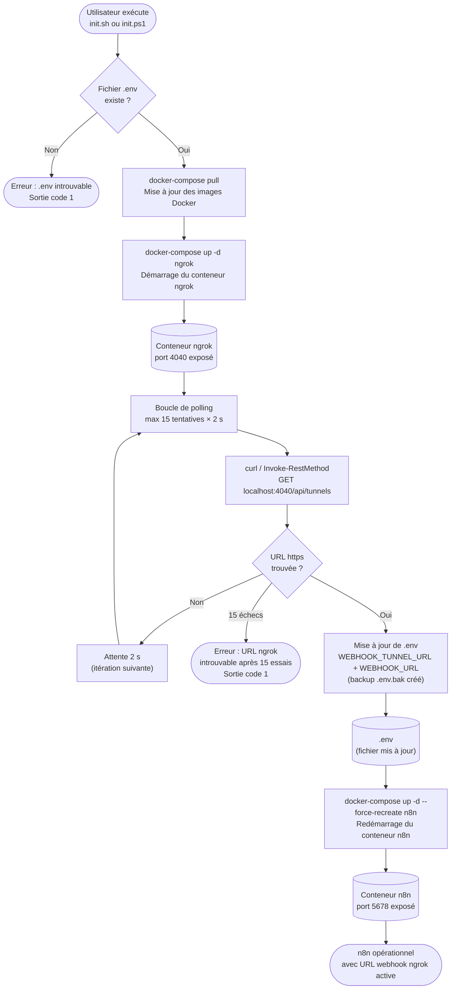

# Diagramme de flux — n8n-ngrok

```mermaid
flowchart TD
    USER(["Utilisateur exécute\ninit.sh ou init.ps1"])

    CHECK_ENV{"Fichier .env\nexiste ?"}
    EXIT_NO_ENV(["Erreur : .env introuvable\nSortie code 1"])

    PULL["docker-compose pull\nMise à jour des images Docker"]

    START_NGROK["docker-compose up -d ngrok\nDémarrage du conteneur ngrok"]

    NGROK_CTR[("Conteneur ngrok\nport 4040 exposé")]

    POLL_LOOP["Boucle de polling\nmax 15 tentatives × 2 s"]
    CALL_API["curl / Invoke-RestMethod\nGET localhost:4040/api/tunnels"]
    CHECK_URL{"URL https\ntrouvée ?"}
    WAIT["Attente 2 s\n(itération suivante)"]
    EXIT_NO_URL(["Erreur : URL ngrok\nintrouvable après 15 essais\nSortie code 1"])

    UPDATE_ENV["Mise à jour de .env\nWEBHOOK_TUNNEL_URL + WEBHOOK_URL\n(backup .env.bak créé)"]

    ENV_FILE[(".env\n(fichier mis à jour)")]

    RESTART_N8N["docker-compose up -d --force-recreate n8n\nRedémarrage du conteneur n8n"]

    N8N_CTR[("Conteneur n8n\nport 5678 exposé")]

    DONE(["n8n opérationnel\navec URL webhook ngrok active"])

    USER --> CHECK_ENV
    CHECK_ENV -->|"Non"| EXIT_NO_ENV
    CHECK_ENV -->|"Oui"| PULL
    PULL --> START_NGROK
    START_NGROK --> NGROK_CTR
    NGROK_CTR --> POLL_LOOP
    POLL_LOOP --> CALL_API
    CALL_API --> CHECK_URL
    CHECK_URL -->|"Non"| WAIT
    WAIT --> POLL_LOOP
    CHECK_URL -->|"15 échecs"| EXIT_NO_URL
    CHECK_URL -->|"Oui"| UPDATE_ENV
    UPDATE_ENV --> ENV_FILE
    ENV_FILE --> RESTART_N8N
    RESTART_N8N --> N8N_CTR
    N8N_CTR --> DONE
```
