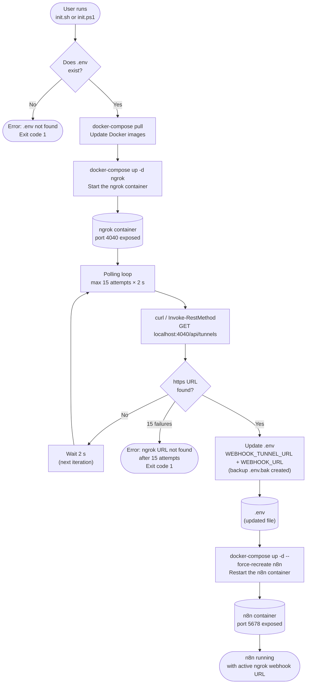

# Flow Diagram — n8n-ngrok

```mermaid
flowchart TD
    USER(["User runs\ninit.sh or init.ps1"])

    CHECK_ENV{"Does .env\nexist?"}
    EXIT_NO_ENV(["Error: .env not found\nExit code 1"])

    PULL["docker-compose pull\nUpdate Docker images"]

    START_NGROK["docker-compose up -d ngrok\nStart the ngrok container"]

    NGROK_CTR[("ngrok container\nport 4040 exposed")]

    POLL_LOOP["Polling loop\nmax 15 attempts × 2 s"]
    CALL_API["curl / Invoke-RestMethod\nGET localhost:4040/api/tunnels"]
    CHECK_URL{"https URL\nfound?"}
    WAIT["Wait 2 s\n(next iteration)"]
    EXIT_NO_URL(["Error: ngrok URL not found\nafter 15 attempts\nExit code 1"])

    UPDATE_ENV["Update .env\nWEBHOOK_TUNNEL_URL + WEBHOOK_URL\n(backup .env.bak created)"]

    ENV_FILE[(".env\n(updated file)")]

    RESTART_N8N["docker-compose up -d --force-recreate n8n\nRestart the n8n container"]

    N8N_CTR[("n8n container\nport 5678 exposed")]

    DONE(["n8n running\nwith active ngrok webhook URL"])

    USER --> CHECK_ENV
    CHECK_ENV -->|"No"| EXIT_NO_ENV
    CHECK_ENV -->|"Yes"| PULL
    PULL --> START_NGROK
    START_NGROK --> NGROK_CTR
    NGROK_CTR --> POLL_LOOP
    POLL_LOOP --> CALL_API
    CALL_API --> CHECK_URL
    CHECK_URL -->|"No"| WAIT
    WAIT --> POLL_LOOP
    CHECK_URL -->|"15 failures"| EXIT_NO_URL
    CHECK_URL -->|"Yes"| UPDATE_ENV
    UPDATE_ENV --> ENV_FILE
    ENV_FILE --> RESTART_N8N
    RESTART_N8N --> N8N_CTR
    N8N_CTR --> DONE
```
